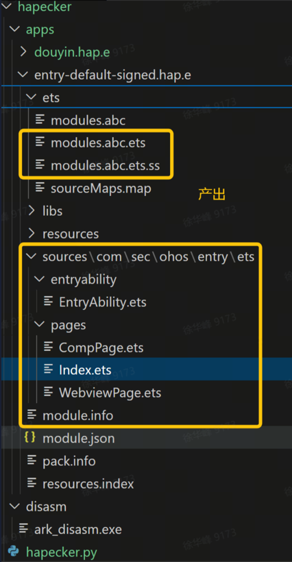

# 鸿蒙方舟abc反编译Demo

## 使用
`python hapecker.py -p entry-default-signed.hap`

## 产物



## 反编译效果

- 反编译代码
```code
function #17241112467781525069#(any a0, any a1, any a2, any a3, any a4) <static> {
    v1 = a1
    v3 = a3
    (v3 == false) != 0 : jmp jump_label_0
    hilog.error(DOMAIN_NUMBER,TAG,"Failed to create subscriber. Code is "+a3.code+", message is "+a3.message+"")
  jump_label_0:
    hilog.info(DOMAIN_NUMBER,TAG,"Succeeded in creating subscriber.")
    //TD slot- a4(save)
    (null !== subscriber) == 0 : jmp jump_label_1
    commonEventManager.subscribe(subscriber,this.#1191169917258594260#:(any,any,any,any,any),)
    jmp jump_label_2
  jump_label_1:
    hilog.error(DOMAIN_NUMBER,TAG,"Need create subscriber")
  jump_label_2:
}
```

- abc字节码
```code
L_ESSlotNumberAnnotation:
        u32 slotNumberIdx { 0x1a }
.function any com.sec.ohos.entry.ets.pages.CompPage.#17241112467781525069#(any a0, any a1, any a2, any a3, any a4) <static> {
        mov v0, a0
        mov v1, a1
        mov v2, a2
        mov v3, a3
        mov v4, a4
        lda v3
        isfalse
        jnez jump_label_0
        ldexternalmodulevar 0x1
        throw.undefinedifholewithname "hilog"
        sta v7
        lda v7
        ldobjbyname 0x0, "error"
        sta v6
        ldlexvar 0x1, 0x0
        throw.undefinedifholewithname "DOMAIN_NUMBER"
        sta v8
        ldlexvar 0x1, 0x1
        throw.undefinedifholewithname "TAG"
        sta v9
        lda.str "Failed to create subscriber. Code is "
        sta v10
        lda v3
        sta v11
        lda v11
        ldobjbyname 0x2, "code"
        add2 0x4, v10
        sta v10
        lda.str ", message is "
        add2 0x5, v10
        sta v10
        lda v3
        sta v11
        lda v11
        ldobjbyname 0x6, "message"
        add2 0x8, v10
        sta v10
        lda.str ""
        add2 0x9, v10
        sta v10
        lda v6
        callthis3 0xa, v7, v8, v9, v10
        ldundefined
        ldundefined
        returnundefined
jump_label_0:
        ldexternalmodulevar 0x1
        throw.undefinedifholewithname "hilog"
        sta v7
        lda v7
        ldobjbyname 0xc, "info"
        sta v6
        ldlexvar 0x1, 0x0
        throw.undefinedifholewithname "DOMAIN_NUMBER"
        sta v8
        ldlexvar 0x1, 0x1
        throw.undefinedifholewithname "TAG"
        sta v9
        lda.str "Succeeded in creating subscriber."
        sta v10
        lda v6
        callthis3 0xe, v7, v8, v9, v10
        lda v4
        sta v6
        ldlexvar 0x0, 0x0
        throw.undefinedifholewithname "subscriber"
        lda v6
        sta v6
        lda v6
        stlexvar 0x0, 0x0
        ldlexvar 0x0, 0x0
        throw.undefinedifholewithname "subscriber"
        sta v6
        ldnull
        strictnoteq 0x10, v6
        jeqz jump_label_1
        ldexternalmodulevar 0x0
        throw.undefinedifholewithname "commonEventManager"
        sta v7
        lda v7
        ldobjbyname 0x11, "subscribe"
        sta v6
        ldlexvar 0x0, 0x0
        throw.undefinedifholewithname "subscriber"
        sta v8
        definefunc 0x13, com.sec.ohos.entry.ets.pages.CompPage.#1191169917258594260#:(any,any,any,any,any), 0x2
        sta v9
        lda v6
        callthis2 0x14, v7, v8, v9
        jmp jump_label_2
jump_label_1:
        ldexternalmodulevar 0x1
        throw.undefinedifholewithname "hilog"
        sta v7
        lda v7
        ldobjbyname 0x16, "error"
        sta v6
        ldlexvar 0x1, 0x0
        throw.undefinedifholewithname "DOMAIN_NUMBER"
        sta v8
        ldlexvar 0x1, 0x1
        throw.undefinedifholewithname "TAG"
        sta v9
        lda.str "Need create subscriber"
        sta v10
        lda v6
        callthis3 0x18, v7, v8, v9, v10
jump_label_2:
        ldundefined
        returnundefined
}
```


